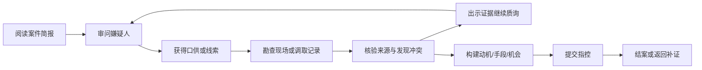

# AI Detective Game V2 项目需求文档

> 文档状态：规划稿  
> 版本：V2.0  
> 日期：2026-08-31  
> 基线：当前 React + Vite / FastAPI / MySQL / Kimi K3 的 V1 项目  
> 体验依据：[V1 单局体验审计](docs/V2-PLAYTEST-AUDIT.md)

## 1. 产品定义

### 1.1 一句话定义

AI Detective Game V2 是一款由 AI 动态生成案件、由确定性世界状态约束所有回答的调查推理游戏；玩家可以自然提问、核验来源、指出矛盾并构建证据链，而 NPC 可以撒谎、回避或改口，但不能改变世界事实。

### 1.2 V2 的核心变化

V1 已经完成“动态案件 + 锁定世界 + 自由输入 + 证据指控”的可玩闭环。V2 的重点不是扩大内容数量，而是把交互内核从：

> 玩家问题 → 命中一个话题 → 返回一条固定口供

升级为：

> 玩家问题 → 解析具体意图和引用 → 查询 NPC 可知事实 → 决定真话/谎言/回避策略 → 受约束地生成自然回答 → 校验所有事实断言

### 1.3 产品承诺

1. **问什么，先答什么。** 玩家问 20:00，NPC 不得用 21:10 的固定口供代替回答。
2. **事实永远不漂移。** 世界事实、时间线和证据来源在一局开始后不可变。
3. **谎言也有规则。** NPC 只能使用案件生成时存在的谎言计划、隐瞒或合理回避，不能即兴创造新事实。
4. **证据有来路。** 口供只是口供，线索需要调取来源或交叉验证后才能成为可用于指控的证据。
5. **失败可理解。** 玩家必须知道自己的推理正确在哪里、证据链断在哪里，以及下一次可以怎样做得更好。

## 2. V2 目标与非目标

### 2.1 产品目标

- 让自然语言审问表现为真正的上下文对话，而不是隐藏菜单；
- 让玩家能够验证口供、形成矛盾、追踪来源并主动推进调查；
- 在不牺牲世界一致性的前提下，提高 NPC 的个性、情绪与反应真实性；
- 降低错误理解、证据管理和页面滚动造成的无效操作；
- 让指控和结案复盘清楚反映玩家自己的调查过程；
- 保留 V1 的视觉身份、三栏工作台和确定性判定优势。

### 2.2 V2 非目标

- 不做多人联机、实时对抗或主持人模式；
- 不做 3D 场景漫游和复杂移动系统；
- 不以完整语音合成作为上线阻塞项；
- 不生成现实案件、真实人物或重口味犯罪细节；
- 不允许模型直接决定真凶、修改 Truth DB 或自由判定胜负；
- 不在 V2 首发开放玩家自制案件市场。

### 2.3 默认目标用户

- 喜欢推理、密室、剧本杀和互动小说的轻中度玩家；
- 愿意进行 15–30 分钟单局体验的桌面或平板用户；
- 不需要理解提示词、数据库或 AI 工作原理，也能自然完成调查。

## 3. 设计原则

### 3.1 事实与表达分离

后端负责事实检索、知识边界、谎言选择和胜负判定；Kimi K3 只负责在允许的断言范围内进行理解补充和语言表达。

### 3.2 真实不等于全知

NPC 可以不知道、记不清、只看到局部，也可以因私心隐瞒。但“不知道”和“撒谎”必须由隐藏世界状态定义，不能由模型临场决定。

### 3.3 便利不等于自动破案

系统可以自动整理时间、来源和潜在冲突，但不直接告诉玩家谁在撒谎，也不自动选择关键证据。

### 3.4 每次消耗都必须有价值

只有系统成功理解并执行了一个有效调查动作，才消耗调查额度。澄清、服务器错误、低置信度解析和界面误操作不扣额度。

### 3.5 保留现有设计语言

V2 延续黑色、米白、荧光绿、档案字体和三栏调查桌，不做无必要的视觉重构；改造重点是信息层级、状态表达、对话反馈和响应式行为。

## 4. 核心体验与用户流程

### 4.1 核心循环



### 4.2 标准单局流程

1. 从已校验案件池中创建一局；
2. 阅读案件简报、死亡窗口和初始现场记录；
3. 在嫌疑人、现场和系统记录之间选择调查动作；
4. 自由提问，或使用时间、人物、证据、历史口供上下文 chips；
5. 将 NPC 说法记录为口供，把其提及的可调查事项保存为线索；
6. 调取来源或复验后，将线索升级为已核验证据，或标记为存在冲突；
7. 出示证据并引用旧口供，观察 NPC 的坚持、改口、回避或失言；
8. 在指控构建器中选择嫌疑人，并为动机、手段、机会分别放入证据；
9. 标准难度可先进行一次不揭露真凶的检方预审；
10. 最终提交后查看“我的调查 vs 案件真相”复盘。

### 4.3 游戏状态

- `CREATING`：案件正在从生成池分配或生成；
- `ACTIVE`：调查进行中；
- `REVIEWED`：已使用预审，但仍可继续调查；
- `SOLVED`：最终指控正确且证据链充分；
- `FAILED`：最终指控错误、证据不足后放弃，或调查额度耗尽后错误结案；
- `ABANDONED`：玩家主动放弃；
- `ERROR_RECOVERABLE`：外部模型或网络异常，游戏状态未丢失，可重试。

## 5. V2 调查资源规则

### 5.1 标准难度

- 每局默认 18 点调查额度；
- 一次成功执行的审问、出示证据、现场勘查、记录调取或物证复验消耗 1 点；
- 查看已获得资料、筛选、对比、整理笔记和构建指控不消耗额度；
- 解析置信度不足时，系统先提出澄清，不消耗额度；
- 网络失败、模型超时、输出校验失败和服务端异常不消耗额度；
- 重复询问已回答的问题时，先提示“已问过”，玩家确认继续后才消耗额度；
- 额度为 0 时不能获取新信息，但可以阅读资料、构建并提交指控。

### 5.2 难度预留

- **标准模式：** 一次检方预审，可返回调查，不揭露真凶；
- **硬核模式：** 无意图提示、无预审、一次最终指控；
- **剧情模式（P2）：** 更多额度、明确上下文建议和更强的笔记辅助。

## 6. 功能需求：真实性

### V2-AUTH-01 结构化问题理解（P0）

每次自由提问必须被解析为 `QuestionFrame`：

- `dialogue_act`：询问、确认、质疑、纠正、引用、要求解释、指责；
- `intent`：行踪、最后见面、关系、动机、手段、权限、证人、来源等；
- `subject_ids`：问题涉及的人物；
- `time_range`：明确时间、模糊时间或死亡窗口引用；
- `location_ids`：涉及地点；
- `evidence_ids`：本次出示或提及的证据；
- `prior_claim_ids`：引用的历史口供；
- `requested_slots`：玩家真正要求回答的内容；
- `confidence`：解析置信度。

要求：

- “晚上 8 点左右”解析为可配置的近似区间，例如 19:45–20:15；
- “你刚才不是说整晚没见过人吗”必须引用最近匹配口供；
- “登录账号是你的”必须把账号所有权与已出示记录绑定；
- “有什么目击者吗”必须进入证人/佐证意图，不能因为同轮出现其他关键词而返回无关证据；
- 置信度低于阈值时返回 1–2 个澄清选项，不直接执行调查。

### V2-AUTH-02 NPC 知识边界（P0）

案件生成时为每名 NPC 建立 `KnowledgeProfile`：

- 亲眼看见、亲耳听见、亲自执行的事实；
- 从他人处得知的二手信息；
- 不知道的事实；
- 知道但计划隐瞒的事实；
- 对已出示证据新增的“被告知信息”。

NPC 不得回答知识边界之外的事实。可以说“不知道”“没看到”“只能确认到这里”，但不能为了对话流畅而补齐世界。

### V2-AUTH-03 精确时间回答（P0）

- 每名 NPC 的调查窗口必须由连续或明确缺口的时间段构成；
- 问某个时间点时，只能检索覆盖该时间点的事件或声明未知；
- 玩家询问 20:00 时，不得以 21:10–21:25 的行踪作为直接答案；
- 若玩家所问时间与案件无关，NPC仍应直接回答，再可补充“死亡窗口内我在……”；
- 对时间模糊词“之前、之后、那会儿、案发时”必须结合对话上下文解析。

### V2-AUTH-04 受约束回答计划（P0）

在生成自然语言前，后端必须创建内部 `AnswerPlan`：

- `coverage`：直接回答、部分回答、澄清、拒绝、回避；
- `authorized_fact_ids`：允许说出的世界事实；
- `authorized_claim_ids`：允许使用的真实口供或谎言；
- `omitted_slots`：有意隐瞒的内容；
- `response_strategy`：说真话、使用预设谎言、模糊化、转移、拒答；
- `reaction_state`：平静、谨慎、防御、动摇；
- `must_address`：时间、人物、证据或旧口供等必须正面回应的点。

AI 只能把 Answer Plan 转成自然语言，不能自行选择新的事实或谎言。

### V2-AUTH-05 谎言计划（P0）

每条谎言必须在案件生成时包含：

- `claim_id`；
- 被否认或替换的 `fact_id`；
- 撒谎原因；
- 可用条件与不能使用的条件；
- 可坚持的范围；
- 被何种证据击穿；
- 被击穿后的允许反应：坚持、缩小表述、改口、拒答或承认局部事实。

压力状态只能改变披露策略，不能改变事实。NPC 改口时，旧口供必须保留并形成新的矛盾记录。

### V2-AUTH-06 对话记忆与引用（P0）

- 每条对话保存涉及的事实、口供、时间、人物和证据；
- 当前 NPC 能访问本人与玩家的全部历史对话；
- “你刚才说”“前面你承认”“这与门禁记录不一致”等表达必须解析到具体对象；
- 同一问题在状态未变化时可以换措辞，但事实断言必须一致；
- 状态因证据或压力发生变化时，可以披露更多预定义信息，但必须说明或表现出变化原因。

### V2-AUTH-07 事实断言校验（P0）

自然语言生成结果必须同时返回内部 `assertions[]`，每条绑定 `fact_id` 或 `claim_id`。服务端执行：

1. 是否全部属于 Answer Plan 的允许集合；
2. 时间、人物、地点和数值是否与绑定对象一致；
3. 是否回答了 `must_address`；
4. 是否意外暴露隐藏字段或真凶信息；
5. 是否与该 NPC 的历史口供产生未授权冲突。

校验失败时最多重试一次；仍失败则使用确定性安全模板。未经校验的模型文本不得进入玩家对话记录。

### V2-AUTH-08 案件一致性与可解性模拟（P0）

每个生成案件在进入可玩池前必须通过：

- Schema 校验；
- 时间连续性和地点移动可行性校验；
- NPC 知识边界校验；
- 每条谎言与事实的冲突引用校验；
- 每条关键证据的来源、发现路径和证明维度校验；
- 至少一组动机、手段、机会闭合证据链；
- 至少两种可达的关键证据组合；
- 红鲱鱼可被至少一条证据排除；
- 典型问题集自动模拟，确保不会出现错时回答、无关回答或死路。

## 7. 功能需求：证据与调查

### V2-EVI-01 信息类型分离（P0）

信息对象必须区分：

- `TESTIMONY`：NPC 口供，可能为真、假、片面或未知；
- `LEAD`：值得调查的线索，尚未核验；
- `DIGITAL_RECORD`：门禁、日志、排程、监控等系统记录；
- `PHYSICAL_EVIDENCE`：物证、样本、痕迹；
- `WITNESS_OBSERVATION`：第三方目击或听闻；
- `ANALYSIS_RESULT`：复验、比对或推导结果。

客户端不得把所有对象统一显示为“已验证”。

### V2-EVI-02 核验状态（P0）

每个信息对象独立拥有：

- `UNVERIFIED`：未核实；
- `REQUESTED`：已申请调取，等待结果；
- `VERIFIED`：来源已核验；
- `CONTESTED`：与另一来源冲突；
- `INVALIDATED`：已被可靠来源否定。

状态变化必须记录操作者、来源、时间和触发动作。状态标签同时使用文字、图标和颜色。

### V2-EVI-03 可信发现路径（P0）

- NPC 说“外间可能留有排程草稿”时，只解锁线索和“调取外间操作台”动作；
- 完成调取后才生成对应数字记录，并显示账号、时间和来源；
- NPC 口供不能单独把院方系统记录升级为已验证；
- 初始证据必须说明为何在开局即可获得；
- 每条证据都显示来源类型、取得方式、涉及时间和关联人物。

### V2-EVI-04 证据关系（P0）

后端维护但不直接泄露真相的关系：

- `supports_claim_ids`；
- `contradicts_claim_ids`；
- `related_subject_ids`；
- `time_range`；
- `proof_dimensions`：动机、手段、机会、身份、因果、矛盾；
- `source_independence_group`：防止多条证据实际来自同一不可靠来源。

客户端可以提示“可能与某口供冲突”，但由玩家决定是否加入矛盾夹。

### V2-EVI-05 调查动作（P0/P1）

V2 首发至少提供：

1. **审问 NPC（P0）**：自由提问、引用口供、出示证据；
2. **调取系统记录（P0）**：门禁、监控、排程、登录日志；
3. **勘查现场（P0）**：检查房间、设备和显眼物品；
4. **物证复验（P1）**：对比样本、标签、文件或痕迹；
5. **交叉询问（P1）**：用 A 的口供质询 B，但不向 B 暴露系统内部真伪。

每个动作必须由案件定义可发现内容和成本，AI 不得自行创造调查结果。

## 8. 功能需求：NPC 沉浸感

### V2-NPC-01 独立人物声音（P0）

每名 NPC 生成并锁定：

- 正式程度、句长、词汇偏好；
- 是否先给结论、是否爱补充细节；
- 犹豫、纠正、打断和防御的表达方式；
- 面对权威、证据和旧口供时的态度；
- 禁止出现的语言习惯，避免所有角色同质化。

人物风格只影响表达，不影响事实内容。

### V2-NPC-02 有限压力状态（P1）

每名 NPC 使用可解释的状态机：

- `CALM` 平静；
- `GUARDED` 戒备；
- `DEFENSIVE` 防御；
- `UNSTEADY` 动摇。

状态由证据强度、被指出矛盾次数、秘密触发点和人格阈值决定。状态变化只解锁既有口供或反应，不新增世界事实。

### V2-NPC-03 证据特定反应（P0）

- NPC 必须称呼或明确指向本轮证据的核心内容；
- 被问账号时回应账号，被问时间时回应时间，被问权限时回应权限；
- 如果证据与自己无关，应说明为何无关，而不是返回通用 evidence 口供；
- 如果证据击穿谎言，根据 Lie Plan 坚持、改口、拒答或承认局部；
- 连续出示相同证据时，系统提示已使用，不默认消耗额度。

### V2-NPC-04 氛围反馈（P1）

- 显示对话时间戳和当前出示的证据；
- 使用短暂、可跳过的思考或停顿反馈，不伪装真实录音；
- “录音中”应与可回看的口供记录相连；
- 关键状态变化可使用细微动画与声效，但默认不过度打断；
- 提供静音、减少动态和关闭打字效果选项。

## 9. 功能需求：便捷性与工作台

### V2-UX-01 问题编辑器（P0）

输入区保留自由文本，并增加可选上下文 chips：

- 时间：例如 `20:00 左右`；
- 人物：例如 `死者沈砚`；
- 证据：例如 `未提交排程草稿`；
- 旧口供：例如 `你说“21:00 后没下过三层”`。

系统解析后可显示紧凑的“理解为：询问 20:00 行踪”提示。低置信度时必须让玩家选择或编辑，不直接发送。

### V2-UX-02 上下文追问（P0）

每轮回答后最多提供 3 个不剧透的快捷动作：

- 追问未回答的时间或人物；
- 引用本轮口供继续确认；
- 出示当前已拥有且相关的证据。

快捷动作必须来源于当前案件状态，不能生成不存在的线索。

### V2-UX-03 自动调查笔记（P1）

笔记包含：

- 每名嫌疑人的时间线；
- 已确认、未核实和有冲突的口供；
- 关键时间缺口；
- 玩家手动固定的证据和文字备注；
- 潜在矛盾对，但不显示哪一方为真；
- 最近一次调查位置和筛选状态。

### V2-UX-04 嫌疑人列表（P1）

每名嫌疑人显示：

- 已完成的有效审问数；
- 未核实口供数；
- 潜在矛盾数；
- 死亡窗口是否仍有时间缺口；
- 当前情绪仅通过克制的文字/视觉提示表达，不显示精确数值。

### V2-UX-05 证据板（P0）

- 支持按状态、来源、人物、时间和证据类型筛选；
- 支持固定、并排对比、加入指控和出示质询；
- 卡片首层只展示标题、状态、来源、关键时间和关联人物；
- 展开后展示原始记录、取得方式、相关口供和玩家备注；
- 新证据出现时保留当前位置并提供可撤销的轻量通知，避免强制跳转。

### V2-UX-06 布局与滚动（P1）

- 桌面端保留三栏，但页面只使用一个主要纵向滚动区；
- 对话输入区固定在可视区底部，不遮挡最后一条回答；
- 证据详情使用抽屉或可控面板，避免右栏多层滚动；
- 1024px 以下切换为“嫌疑人 / 审问 / 案件板”三页签；
- 返回某嫌疑人时恢复对话位置、输入草稿和所选证据。

### V2-UX-07 会话恢复（P0）

- 所有有效动作采用 request ID 幂等写入；
- 页面刷新、浏览器关闭或短暂断网后恢复案件、输入草稿和面板位置；
- 响应未确认前不先行扣除调查额度；
- Kimi 超时后提供重试，世界状态和已用额度不变。

## 10. 指控与结案

### V2-ACC-01 指控理论构建器（P0）

玩家必须提交：

- 嫌疑人；
- 动机判断；
- 作案手段；
- 作案机会/身份；
- 每个维度对应的 1–2 条证据；
- 可选的自由推理说明。

系统判定基于结构化维度、证据关系和来源独立性。自由推理文本可用于反馈摘要，但不能绕过确定性证明规则，也不能由模型决定对错。

### V2-ACC-02 检方预审（P1）

标准模式允许一次预审：

- 不揭露真凶是否选择正确；
- 只反馈证据链结构，例如“手段已有支持，但账号与实际操作者之间仍缺直接连接”；
- 预审后回到调查，已选理论和证据保留；
- 预审不新增线索、不修改世界状态。

### V2-ACC-03 最终判定（P0）

结果仍为：

- `SOLVED`：嫌疑人正确，且证据链满足全部必要维度和组合规则；
- `INSUFFICIENT`：嫌疑人正确，但证明链缺失；
- `WRONG`：嫌疑人错误。

最终判定必须完全由后端规则完成，并记录使用的规则版本和案件哈希。

### V2-ACC-04 个性化复盘（P1）

结案首屏展示：

- 结果与一句话原因；
- 玩家指控的动机、手段、机会；
- 每条所选证据证明了什么；
- 缺失或错误连接；
- 真凶与事实还原。

后续分区展示：

- “你的调查 vs 真实时间线”；
- 玩家识破、听过但遗漏、未发现的关键谎言；
- 最短完整证据链与玩家链路的差异；
- 未走过的替代调查路径；
- 再来一案和返回档案室。

## 11. 信息架构与页面改造

### 11.1 调查工作台

保留现有顶栏和三栏骨架：

- **左栏：嫌疑人**，增加口供、矛盾、时间缺口状态；
- **中栏：当前调查**，可在审问、现场、记录动作之间切换；
- **右栏：案件板**，整合证据、时间线、口供和案情；
- **底部：问题编辑器**，支持上下文 chips、快捷追问和解析澄清。

### 11.2 视觉层级

- 案件核心信息继续常驻，但减少过宽分隔区占用；
- 对话卡宽度和间距更紧凑，保留人物与玩家的明暗区分；
- 证据状态成为卡片第一层信息，来源与时间优先于长描述；
- 结案页缩短首屏空白，把“你的证据链”放到真相长文之前；
- 正文目标最小 16px，辅助文字原则上不低于 12–13px，并满足目标对比度。

## 12. 对话系统架构

### 12.1 处理流水线

1. **本地预解析：** 提取明确时间、人物、证据 chips 和历史口供引用；
2. **复杂意图解析：** 仅在本地置信度不足时调用 Kimi 获取结构化 QuestionFrame；
3. **Truth Resolver：** 从不可变案件快照中检索 NPC 可知事实；
4. **Deception Policy：** 根据 Lie Plan、秘密、压力和已出示证据选择策略；
5. **Answer Planner：** 创建允许事实、必须回答点和披露边界；
6. **Response Realizer：** Kimi 根据人物声音生成自然语言与内部 assertions；
7. **Assertion Verifier：** 校验事实、时间、权限、知识边界和历史一致性；
8. **Evidence Engine：** 产生口供、线索、冲突或新调查动作；
9. **Event Store：** 原子保存回答、状态变化和额度消耗。

### 12.2 AI 与规则的责任边界

| 能力 | 规则/数据库 | Kimi K3 |
| --- | --- | --- |
| 生成候选案件 | 定义 Schema、约束与校验 | 生成结构化候选内容 |
| 决定真凶和事实 | 锁定并哈希，模型不可修改 | 不参与运行时修改 |
| 问题理解 | 提取明确实体并设置信心阈值 | 处理复杂语义和指代 |
| 选择真话/谎言 | Lie Plan 与状态机确定 | 不得自行决定 |
| 组织 NPC 回答 | 提供 Answer Plan 与允许断言 | 负责自然、个性化表达 |
| 验证回答 | 断言白名单和一致性检查 | 可重写，但不能自证正确 |
| 发现证据 | Discovery Rule 决定 | 不得创造新证据 |
| 胜负判定 | Proof Rule 确定性计算 | 不参与对错判定 |

### 12.3 内部回答结果示意

```json
{
  "question_frame": {
    "dialogue_act": "CHALLENGE",
    "intent": "ACCOUNT_OWNERSHIP",
    "time_range": ["20:50", "21:05"],
    "evidence_ids": ["ev_schedule_draft"],
    "prior_claim_ids": ["claim_no_permission"]
  },
  "answer_plan": {
    "coverage": "DIRECT",
    "strategy": "MAINTAIN_LIE",
    "authorized_claim_ids": ["claim_borrowed_account"],
    "must_address": ["account_owner", "login_time"]
  },
  "response_text": "账号是我的，但那晚终端由项目组轮用。你只凭登录名不能证明是我操作。",
  "assertions": [
    {"claim_id": "claim_borrowed_account"}
  ],
  "consumed_action": true
}
```

`strategy`、授权 ID、断言真伪和内部压力值不得发送给客户端。

## 13. V2 案件数据模型

### 13.1 CaseSnapshot

V2 继续保存完整、不可变、带哈希的 JSON 案件快照，建议 `schema_version = 2`。核心对象：

- `entities`：人物、地点、物品、系统；
- `events`：带起止时间、参与者、地点和因果关系的真实事件；
- `facts`：可被引用的原子事实；
- `knowledge_profiles`：每名 NPC 的知识来源与未知范围；
- `claims`：可说出的真实、虚假、片面或回避口供；
- `lie_plans`：谎言条件、目的、击穿证据和改口策略；
- `evidence`：来源、取得动作、验证状态和证明关系；
- `discovery_graph`：线索到证据的可达路径；
- `proof_rules`：完整证据链和替代组合；
- `persona_styles`：NPC 表达风格；
- `case_validator_version`：生成时使用的校验器版本。

### 13.2 运行时状态

运行时可变状态与 CaseSnapshot 分离：

- 剩余调查额度；
- 对话与调查事件；
- 已知口供、线索和证据；
- 证据核验状态；
- NPC 压力与披露状态；
- 玩家笔记、固定项和筛选；
- 预审与最终指控；
- 请求幂等记录。

任何运行时状态都不得覆写真实事件、事实或证据原文。

## 14. 后端与持久化方案

### 14.1 技术栈

- 保持 FastAPI、Pydantic、SQLAlchemy 与 MySQL；
- 保持 Kimi K3 作为案件生成和受约束语言模型；
- 前端保持 React、TypeScript 与 Vite；
- 不在 V2 为追求架构纯度更换主框架。

### 14.2 MySQL 建议

保留 `game_sessions` 的案件快照和当前进度，并新增：

- `case_inventory`：已生成、已校验、待分配的案件池；
- `game_events`：审问、取证、状态变化、额度消费的追加式事件；
- `dialogue_turns`：问题帧、回答计划版本、公开文本和校验结果；
- `model_runs`：模型、提示词版本、时延、重试和失败原因，不保存密钥；
- `evaluation_runs`：生成案件的模拟问答与可解性结果。

`case_data` 仍是最终事实来源；追加表主要服务恢复、调试和质量评估。

### 14.3 模型与密钥安全

- Kimi API Key 只存在服务端环境变量；
- 客户端不得收到系统提示、真相字段、内部 claim/fact ID 或模型原始输出；
- 日志对玩家输入和模型输出进行长度限制与敏感信息清理；
- 案件快照、提示词和校验器都带版本号，便于重放问题；
- 玩家提示注入不得改变 Answer Plan、访问其他 NPC 隐藏状态或读取 Truth DB。

## 15. API 需求（产品级）

### 15.1 创建案件

`POST /api/v2/cases`

- 优先从已校验案件池分配；
- 目标 3 秒内返回可玩状态；
- 若池为空，返回生成进度而不是长时间无反馈；
- 分配后立即冻结快照并返回内容哈希的短标识。

### 15.2 获取状态

`GET /api/v2/cases/{case_id}`

返回公共简报、调查资源、嫌疑人公共状态、已发现信息、对话、笔记摘要和可执行动作。

### 15.3 审问

`POST /api/v2/cases/{case_id}/interrogations`

请求包含 NPC、自由文本、上下文 chips、出示证据、引用口供和 request ID。

响应有两种：

- `ANSWERED`：返回公开回答、反应、公开口供对象、新线索、建议追问和是否消耗额度；
- `NEEDS_CLARIFICATION`：返回解析选项，不产生 NPC 回答、不消耗额度。

### 15.4 调查动作

`POST /api/v2/cases/{case_id}/investigations`

支持记录调取、现场检查和物证复验。结果必须来自 Discovery Graph。

### 15.5 检方预审

`POST /api/v2/cases/{case_id}/accusations/review`

只返回证据链结构反馈，不返回真凶是否正确。

### 15.6 最终指控

`POST /api/v2/cases/{case_id}/accusations/final`

确定性返回 `SOLVED`、`INSUFFICIENT` 或 `WRONG`，并附个性化复盘数据。

## 16. 性能、可靠性与降级

### 16.1 性能目标

- 已预生成案件创建 p95 小于 3 秒；
- 审问首个可见反馈 p95 小于 1.2 秒；
- 完整回答 p95 小于 5 秒；
- 非 AI 的证据筛选、笔记和页面切换在常规设备上即时响应；
- 恢复一局 200 条以内事件的状态 p95 小于 2 秒。

### 16.2 降级策略

- 本地解析高置信度时不额外调用复杂意图模型；
- Kimi 语言生成超时时使用基于 Answer Plan 的人物化安全模板；
- 输出断言校验失败最多重试一次；
- 模型不可用时仍可继续查看资料、执行确定性调查动作和提交指控；
- 任何失败均不预扣调查额度。

### 16.3 案件预生成池

- 后台生成并校验案件，不阻塞玩家点击“新案件”；
- 案件只有通过全部校验才进入 `READY`；
- 分配后标记 `ASSIGNED`，避免不同请求重复领取；
- 池低于阈值时补充生成；
- 保留确定性模板作为池耗尽与模型故障时的兜底。

## 17. 可访问性需求

- V2 目标为 WCAG 2.2 AA；
- 所有核心动作可用键盘完成，焦点顺序与视觉顺序一致；
- 模态框和抽屉正确管理焦点，关闭后返回触发元素；
- 正文、辅助文字、边框和状态满足目标对比度；
- 交互目标至少 24×24 CSS px，主要操作建议达到 44×44；
- 状态不能只依赖颜色，必须有文字或图标；
- 新证据、剩余额度和错误使用合适的 `aria-live`，避免重复打断；
- 表单有可见标签、具体错误和恢复方式；
- 200% 缩放不丢功能，400% 时核心流程可线性重排；
- 支持 `prefers-reduced-motion`，并提供静音和关闭打字动画；
- 上线前完成键盘、自动化扫描和至少一次 NVDA 或等效屏幕阅读器走查。

## 18. 数据指标与事件

### 18.1 核心质量指标

| 指标 | V2 目标 |
| --- | --- |
| 具体时间问题直接覆盖率 | ≥ 95% |
| 证据特定质询相关率 | ≥ 90% |
| 未授权事实断言进入玩家回答 | 0 |
| 系统误解导致的额度损失 | 0 |
| 有效问题中的错误意图路由率 | < 5% |
| 玩家平均无效调查动作 | < 1 次/局 |
| 可玩案件通过自动可解性校验 | 100% |
| 已发现证据具备来源与状态 | 100% |
| 结案玩家能指出缺失证据环节 | 可用性测试 ≥ 80% |

### 18.2 体验指标

- 首条有用线索获取时间；
- 每局嫌疑人切换次数与调查动作分布；
- 低置信度澄清出现率、接受率和改写率；
- 口供引用、证据出示和矛盾夹使用率；
- 预审后补齐证据的比例；
- 单局完成率、正确指控率和再来一案率；
- 结果页“我的调查 vs 真相”展开率。

### 18.3 隐私原则

- 默认不采集真实身份信息；
- 玩家自由文本只用于本局处理、质量调试和必要日志；
- 若用于离线评估或长期留存，需明确告知并做脱敏、限期与可删除处理。

## 19. 测试策略

### 19.1 单元与属性测试

- 时间表达解析：8 点、20 点、八点左右、案发前十分钟、刚才；
- 人物、地点、证据和旧口供引用；
- NPC 知识边界；
- Lie Plan 条件和被击穿后的允许状态；
- 证据状态与来源独立性；
- 额度只在事务成功后扣除；
- 指控维度、组合规则和幂等性；
- CaseSnapshot 哈希与不可变性。

### 19.2 对话回放测试

将本次体验中的关键问题设为回归用例：

1. 问“晚上 8 点左右你在哪里”，必须回答 20:00 附近，不得只回答 21:00；
2. 纠正“我问的是晚上 8 点”，不得原句复读；
3. 问“你最后一次见到死者是什么时候”，必须提供时间、明确不知道或解释为何回避；
4. 问“有什么目击者吗”，必须回应证人或佐证；
5. 出示排程草稿并问“登录账号是你的”，必须讨论账号与操作者；
6. 引用旧口供指出矛盾，必须承接旧口供；
7. 同一事实换五种问法，断言保持一致；
8. 模型尝试输出未授权细节时，校验器必须拦截。

### 19.3 案件模拟

- 每个生成案件运行标准问题集和随机同义改写；
- 模拟至少一条完整证据发现与指控路径；
- 验证不存在无法获取的关键证据、循环依赖和唯一死路；
- 验证所有嫌疑人在调查窗口内都有可回答或明确未知的时间覆盖；
- 批量统计回答覆盖、重复率、无关率和断言失败率。

### 19.4 前端与端到端测试

- 新建案件、恢复案件、切换调查模式；
- 自由提问、澄清、引用口供、出示证据；
- 调取来源、状态升级、筛选与对比；
- 预审、返回调查、最终指控和复盘；
- API 超时、重复提交、刷新与断网恢复；
- 桌面、平板、窄屏、200% 缩放和键盘全流程。

## 20. V2 验收标准

### 20.1 真实性

- [ ] 玩家问具体时间时，NPC 直接回应覆盖该时间的行踪或明确未知；
- [ ] 玩家引用旧口供时，系统能定位并用于回答计划；
- [ ] 出示不同证据会得到针对各自内容的不同回应；
- [ ] 所有公开事实断言都能追溯到允许的 fact 或 claim；
- [ ] NPC 改口不覆盖旧口供，世界事实和案件哈希不变化；
- [ ] 500 局批量模拟中无未授权事实进入公开回答。

### 20.2 证据与调查

- [ ] 口供、线索与已核验证据在数据和界面上可区分；
- [ ] 线索必须经过定义的来源调取才能升级；
- [ ] 每条证据可查看来源、取得动作、时间和关联人物；
- [ ] 至少支持审问、系统记录和现场勘查三种调查动作；
- [ ] 每局至少存在两条可达的有效证明组合。

### 20.3 便捷性

- [ ] 低置信度解析先澄清且不扣额度；
- [ ] 网络或模型失败不扣额度；
- [ ] 工作台可以按状态、来源、人物和时间筛选；
- [ ] 切换嫌疑人后恢复对话位置、输入草稿和已选证据；
- [ ] 刷新页面后恢复完整调查状态；
- [ ] 1024px 以下核心流程仍可完成。

### 20.4 指控与复盘

- [ ] 指控要求动机、手段、机会与证据映射；
- [ ] 预审不揭露嫌疑人是否选择正确；
- [ ] 最终结果逐项显示玩家证据证明内容和缺失环节；
- [ ] 复盘区分玩家识破、遗漏和未发现的关键口供；
- [ ] 自由推理文本不会取代确定性规则判定。

### 20.5 可访问性与质量

- [ ] 核心流程可仅用键盘完成；
- [ ] 无严重或高等级自动化无障碍问题；
- [ ] 完成至少一次屏幕阅读器人工走查；
- [ ] 前端 lint、类型检查与 production build 通过；
- [ ] 后端单元、集成、回放和批量案件模拟通过。

## 21. 实施计划

以下为单名全栈开发者配合 AI 编程的建议节奏，实际排期按模型稳定性与测试规模调整。

### M0：测量基线与 V2 Schema（3–4 天）

- 固化本次失败对话为回归样本；
- 定义 Event、Fact、KnowledgeProfile、LiePlan、Evidence V2 Schema；
- 增加 schema version、事件日志和提示词版本；
- 建立质量指标与最小离线评估脚本。

**出口：** V2 案件可以被生成、冻结并通过结构校验。

### M1：事实驱动对话内核（7–10 天）

- 实现 QuestionFrame、时间解析和引用解析；
- 实现 Truth Resolver、Deception Policy 和 Answer Planner；
- 接入 Kimi 受约束表达与 assertions 校验；
- 实现低置信度澄清、失败不扣额度和安全模板降级；
- 让本次 8 个关键失败问题全部通过回放测试。

**出口：** 自然提问不再依赖单一 topic→claim 路由。

### M2：证据生命周期与调查动作（6–8 天）

- 拆分口供、线索、记录、物证和分析结果；
- 实现来源调取、现场勘查与状态变化；
- 实现 supports/contradicts 关系和矛盾夹；
- 更新指控证明规则与来源独立性。

**出口：** 玩家能通过可信路径从一句口供走到可指控证据。

### M3：工作台体验升级（6–8 天）

- 问题上下文 chips 和免费澄清；
- 嫌疑人状态、证据筛选与自动笔记；
- 单一主滚动区和窄屏页签；
- 会话恢复、错误反馈和键盘路径。

**出口：** 玩家无需外部记事，也不会因系统误解浪费额度。

### M4：指控、复盘与人物反应（5–7 天）

- 指控理论构建器和一次检方预审；
- 个性化结果对照；
- NPC 独立语气与有限压力状态；
- 结案页信息层级、对比度和导航优化。

**出口：** 指控结果能准确解释玩家自己的证据链。

### M5：案件池、批量验证与发布 QA（5–7 天）

- 案件预生成池和校验队列；
- 批量模拟、断言失败监控和问题案件隔离；
- 性能、恢复、安全、响应式与可访问性测试；
- 修复阻塞问题并完成发布清单。

**出口：** 达到本 PRD 的 V2 完成定义。

## 22. 风险与应对

| 风险 | 影响 | 应对 |
| --- | --- | --- |
| Kimi 结构化输出不稳定 | 问题理解或语言生成失败 | Pydantic 校验、一次重试、安全模板、提示词版本化 |
| 多阶段模型调用导致延迟 | 对话节奏变慢 | 本地预解析、复杂问题才调用意图模型、流式反馈、缓存 |
| 谎言状态机过复杂 | 案件难生成、难测试 | V2 首发限制状态数和每名 NPC 的核心谎言数 |
| 自动矛盾提示过度剧透 | 推理乐趣下降 | 只提示“可能冲突”，不判定哪条为真，不自动加入指控 |
| 证据状态过多增加负担 | 便捷性反而下降 | 数据层细分，界面只呈现 4–5 个清晰状态 |
| 预审成为答案提示 | 降低挑战 | 只反馈证明结构，不反馈嫌疑人正确性和具体缺失证据名 |
| 生成案件仍可能无解 | 玩家挫败和信任下降 | 预生成池、模拟器、双路径校验、问题案件自动隔离 |
| 结果页内容继续过长 | 复盘信息利用率低 | 首屏先展示玩家差距，真相长文与全部谎言渐进展开 |

## 23. V2 完成定义

V2 只有在以下条件全部满足时才算完成：

1. 当前截图中出现的错时回答、重复纠正、目击者误路由、证据泛答和账号追问失效均有自动回归测试并通过；
2. 每条 NPC 回答的事实断言都可追溯、可校验，运行时无法修改世界事实；
3. 玩家能通过至少三类调查动作把口供或线索核验为证据；
4. 低置信度、网络失败和模型失败不会浪费调查额度；
5. 指控明确映射动机、手段、机会，复盘能解释玩家自己的缺口；
6. 案件池中的每局都通过结构、逻辑、可达性和典型问答模拟；
7. 主要性能目标、键盘流程、响应式和可访问性发布检查通过；
8. React/Vite、FastAPI、MySQL 与 Kimi K3 的现有 V1 数据可平滑迁移或并行运行。

