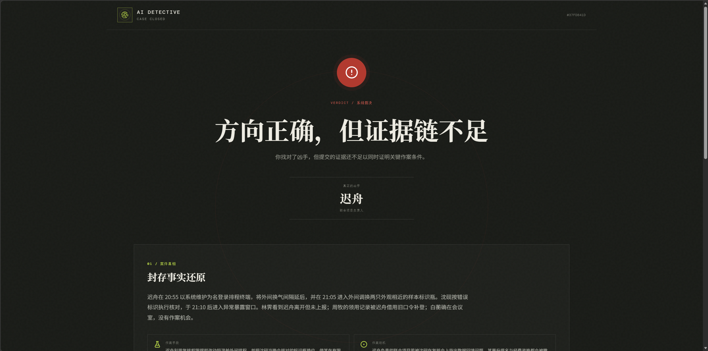
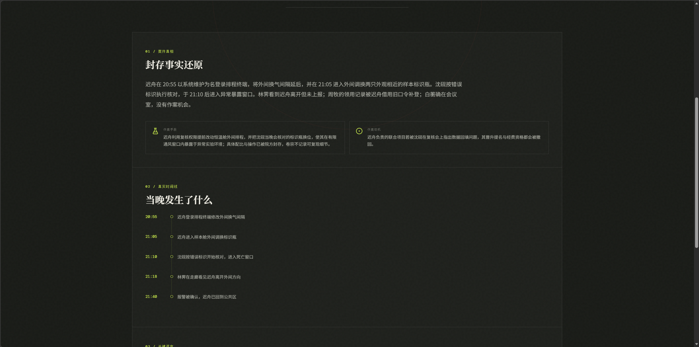
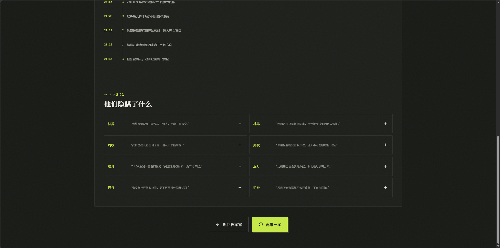
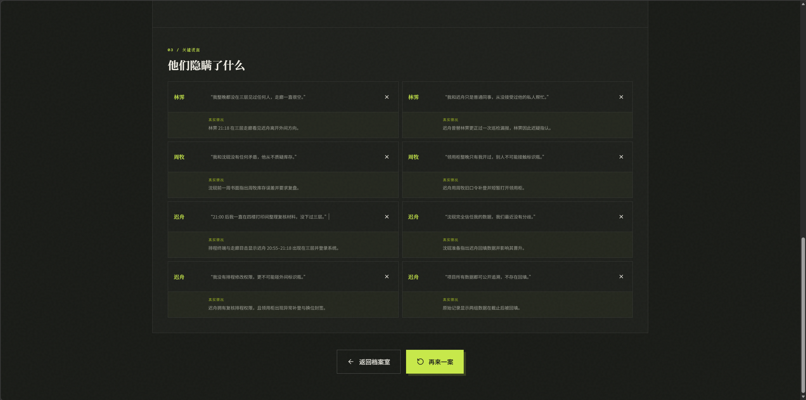

# AI Detective Game V1 单局体验审计

> 审计日期：2026-08-31  
> 审计对象：案件「恒温舱误差」从审问、取证、指控到结案复盘的完整流程  
> 证据范围：用户提供的 11 张游戏截图，以及当前 V1 的对话、证据与指控实现  
> 审计目标：从真实性、沉浸式体验、便捷性与可访问性四个角度，为 V2 确定优先级

## 1. 结论摘要

V1 已经建立了鲜明、完整的视觉身份，也把“世界事实锁定、NPC 可以撒谎”的核心承诺表达清楚；但自由输入目前仍被压缩成少量隐藏话题，再返回该话题对应的一条固定口供。结果是：界面看起来像自由审讯，实际反馈却更像点击隐藏菜单。

最影响体验的三个问题是：

1. **NPC 没有回答玩家真正问的时间、人物或证据。** 玩家问“晚上 8 点”，NPC却回答 21:00 之后的固定不在场证明；重复强调时间仍得到原句。
2. **口供、线索与已核验证据混在一起。** NPC 提到某件事后，侧栏会直接出现“已验证”的系统证据，缺少可信的调查过程与证据来源链。
3. **系统不理解追问关系。** 玩家指出前后矛盾、询问目击者或强调登录账号时，NPC 没有承接上下文，只重复固定口供；玩家却仍损失提问次数。

因此，V2 不应优先增加更多案件文本，而应先把底层从“话题路由器”升级为“事实驱动的问答与调查系统”。

## 2. 审计范围与玩家目标

### 2.1 玩家目标

玩家需要在有限资源下完成四件事：

- 从嫌疑人口供中找出时间、人物和行为矛盾；
- 通过现场、记录或第三方证词核验口供；
- 形成动机、手段、机会三者闭合的证据链；
- 提交指控，并理解成功或失败的具体原因。

### 2.2 可访问性目标

V2 建议以 WCAG 2.2 AA 为设计目标，至少支持键盘完成核心流程、200% 缩放、清晰焦点、非颜色唯一表达和状态变化播报。本次仅依据截图与局部实现判断风险，不能据此宣称 V1 已满足或不满足完整 WCAG 标准。

## 3. 流程逐步审计

### 步骤 1：建立嫌疑人时间线

**健康度：差**

玩家先询问林霁和白衡“晚上 8 点在哪里”，两人分别回答 21:10–21:25、21:05–21:45 的固定行踪。白衡在玩家明确纠正“我问的是晚上 8 点”后仍原句复读。

主要问题：

- 系统识别了“不在场证明”话题，却没有解析具体时间范围；
- 玩家无法判断 NPC 是故意回避、没有听懂，还是系统出错；
- 第二次纠正没有免费澄清机制，玩家为系统理解失败付费；
- “最后一次见到死者”得到“整晚没见过任何人”，没有直接回答“最后一次”的时间。

V2 机会：把问题解析为“意图 + 时间范围 + 人物 + 地点 + 证据引用”，NPC 必须先直接回答被问范围，再决定补充、撒谎、回避或要求澄清。

### 步骤 2：指出矛盾并出示证据

**健康度：差**

玩家先让林霁解释“三层门禁与报警确认”，再引用她之前“整晚没在三层见过任何人”的说法。NPC 没有承认被质疑，也没有解释冲突，而是切回固定不在场口供。

迟舟的流程暴露得更明显：

- 问“有什么目击者吗”，回答却是“有一份未提交的排程草稿”；
- 出示“未提交排程草稿”后，只把同一句话加上“看了一眼你出示的……”；
- 玩家明确补充“登录账号是你的”，NPC 仍重复原句，没有解释账号、权限或时间。

主要问题：

- 对话没有可被引用的历史口供，也没有“你刚才说过……”的关系解析；
- 出示任何证据都会统一进入一个 evidence 话题，证据内容本身没有参与回答计划；
- 追问、反问、纠正、确认、举证等不同对话行为没有区分；
- NPC 的心理状态不会因压力、证据或被揭穿而变化。

V2 机会：服务端保存每条口供的 claim ID、涉及事实、时间和人物；出示证据时先计算“证据支持/反驳哪些口供”，再生成反应。NPC 可以坚持谎言，但必须针对质疑作出一致的坚持、改口、回避或反击。

### 步骤 3：在工作台管理嫌疑人和证据

**健康度：中等**

三栏结构让嫌疑人、当前审问和证据保持同屏，案件名、死者、地点、死亡窗口也持续可见，桌面端的信息架构基础较好。

主要问题：

- 所有新发现内容几乎都标成“已验证”，NPC 口供、调查线索和客观记录缺少层级；
- “问到某话题”会直接解锁对应证据，证据出现得像奖励掉落，而不像调查所得；
- 嫌疑人列表只显示提问数量，没有“未核实口供、已发现矛盾、关键时间缺口”等调查状态；
- 证据卡文字密、字号小、标签弱，重要来源和相互关系难以快速扫描；
- 对话区存在较多纵向空白和嵌套滚动，频繁切换嫌疑人时上下文容易丢失；
- 只有审问，没有现场勘查、调取记录、复验物证等调查动作，核心循环很快重复。

V2 机会：把证据生命周期改成“口供/线索 → 调取来源 → 已核验/有冲突 → 关键证据”，并提供自动时间线、矛盾夹和来源筛选。

### 步骤 4：提交指控并获得判定

**健康度：中等偏弱**

“方向正确，但证据链不足”能区分嫌疑人正确与证明不足，这是正确的产品方向；但页面立即公开真凶和完整真相，玩家无法回到调查补齐证据。

主要问题：

- 判定只告诉玩家“证据不足”，没有在首屏展示已选证据分别证明了什么、还缺哪一环；
- 玩家输入的推理文本没有进入判定，指控本质上只是“嫌疑人 + 证据 ID”；
- 一次证据选择失误就直接结案并揭底，学习反馈和挽回空间不足；
- 结果页首屏留白较多，而最有用的证据差距信息在更下方或缺失。

V2 机会：指控改为“嫌疑人 + 动机 + 手段 + 机会 + 对应证据”的理论构建器；标准难度允许一次不揭底的“检方预审”，明确缺失维度后返回调查。

### 步骤 5：查看真相时间线和谎言复盘

**健康度：中等偏好**

结案页给出事实还原、时间线和每条谎言背后的真实情况，内容完整，仪式感也强，是 V1 最成熟的环节。

主要问题：

- 复盘列出所有谎言，却没有区分“玩家识破、玩家听过但漏掉、玩家从未发现”；
- 没有把玩家选中的证据连到真实时间线，也没有展示完整证据链图；
- 大段灰色小字叠在深色背景上，可读性和低视力风险较高；
- 页面很长，关键反馈与“再来一案”之间需要大量滚动；
- 复盘强调标准答案，较少解释玩家的推理过程哪里正确、哪里断裂。

V2 机会：增加“你的调查 vs 案件真相”对照视图，逐项显示抓到的矛盾、遗漏的线索、选中证据的证明维度及最短完整证据链。

## 4. 已有优势，应在 V2 保留

- **视觉识别强。** 黑、米白与荧光绿形成稳定的侦查档案风格，首页、工作台和结案页语言一致。
- **三栏桌面工作台合理。** 在大屏上能同时保持人物、对话和证据上下文。
- **世界锁定表达清楚。** `WORLD LOCKED` 与底部说明把“事实不随口供变化”这个产品承诺可视化。
- **证据式指控方向正确。** 玩家不能只猜凶手，必须提交证据。
- **结案仪式感强。** 真相揭示、时间线和谎言复盘具备继续扩展的良好骨架。

## 5. 三条主线的问题与改进方向

### 5.1 真实性

| 优先级 | 不足 | 玩家感受 | V2 改进 |
| --- | --- | --- | --- |
| P0 | 不解析具体时间、人物和引用对象 | NPC 像没听懂 | 结构化问题帧：意图、时间、人物、地点、证据、历史口供 |
| P0 | 每个话题只有一条固定口供 | 重复提问只会复读 | 先生成受约束 Answer Plan，再由 AI 按人设表达 |
| P0 | 没有对话记忆与矛盾状态 | 追问无法推进 | 保存 claim 引用、压力状态、已出示证据和改口历史 |
| P0 | 口供直接变成“已验证证据” | 证据不可信 | 引入口供、线索、已核验、存在冲突、关键物证等状态 |
| P0 | 出示证据不参与推理 | 举证只是装饰 | 计算证据与口供的支持/反驳关系，生成证据特定回应 |
| P1 | 案件事实有时间线，但 NPC 知识边界较粗 | NPC 知道或不知道什么不自然 | 为每个 NPC 生成 knowledge matrix 与可见范围 |
| P1 | 判定忽略玩家理论文本 | 像选答案而非办案 | 映射动机、手段、机会及相应证据，校验理论结构 |

### 5.2 沉浸式体验

| 优先级 | 不足 | 玩家感受 | V2 改进 |
| --- | --- | --- | --- |
| P0 | 四名 NPC 说话结构相近 | 人物像同一模型换名字 | 独立语气、用词、句长、犹豫方式与禁区 |
| P1 | 证据压力不改变反应 | 审问没有戏剧推进 | 冷静→戒备→防御→失言的有限状态机 |
| P1 | 只有问答一种调查行为 | 循环单调 | 加入现场勘查、记录调取、物证复验三类动作 |
| P1 | “录音中”等元素主要是装饰 | 氛围与玩法脱节 | 时间戳、停顿、证据推入、状态变化与轻量声效 |
| P1 | 结案只展示标准答案 | 缺少“这是我查出来的”成就感 | 将玩家发现路径叠加到真相时间线和证据图 |
| P2 | 案件生成等待可能较长 | 新一局启动不够利落 | 后台预生成已校验案件池，启动目标小于 3 秒 |

### 5.3 便捷性

| 优先级 | 不足 | 玩家感受 | V2 改进 |
| --- | --- | --- | --- |
| P0 | 系统误解仍扣提问次数 | 被产品惩罚 | 低置信度先免费确认；澄清、系统错误和空回答不扣次数 |
| P0 | 不知道系统理解成了什么 | 难以修正问题 | 输入区显示可编辑的时间/对象/证据上下文 chips |
| P0 | 证据列表难以快速比较 | 需要反复滚动和记忆 | 按状态、来源、人物、时间筛选，支持固定和对比 |
| P1 | 没有自动调查笔记 | 认知负荷过高 | 自动生成嫌疑人时间线、口供摘要与潜在矛盾 |
| P1 | 嫌疑人列表信息弱 | 切换成本高 | 显示已问、未核实、矛盾、关键时间缺口 |
| P1 | 结果页未解释选择差距 | 不知道如何进步 | “所选证据→证明维度→缺失环节”即时对照 |
| P1 | 三栏与嵌套滚动依赖宽屏 | 小屏和键盘操作困难 | 响应式抽屉、单一主滚动区、可预测焦点顺序 |

## 6. 可访问性风险

### 6.1 截图中可见的风险

- 深色结案页上的灰色小字、细边框和微型标签可能存在对比度与字号风险；
- 证据卡标签、展开加号和部分顶部标签的点击目标看起来偏小；
- 绿色、红色和灰色承担了较多状态含义，需要同步文字和图标；
- 工作台存在多个独立滚动区域，可能造成键盘焦点和阅读顺序混乱；
- 新证据、剩余次数和 NPC 状态变化需要非侵入式的屏幕阅读器播报；
- 若加入打字、闪烁、声效或压力动画，必须提供减少动态和静音选项。

### 6.2 无法从截图确认的项目

- 键盘是否能完成嫌疑人切换、证据出示和指控；
- 焦点样式、焦点陷阱和返回焦点是否正确；
- 语义标题、表单标签、错误关联和屏幕阅读器名称；
- 200%/400% 缩放与窄屏重排；
- 实际颜色对比度数值和动态效果是否可关闭。

这些内容需要在 V2 实现后通过代码检查、键盘走查、自动化扫描和至少一次屏幕阅读器人工测试验证。

## 7. V2 优先级建议

### P0：先让系统“听懂并回答”

1. 结构化问题理解与精确时间解析；
2. 事实检索、NPC 知识边界与受约束回答计划；
3. 对话记忆、引用旧口供和证据特定回应；
4. 口供/线索/已核验/冲突的证据生命周期；
5. 低置信度免费澄清，错误路由不消耗调查资源；
6. 指控证据映射与缺失维度解释；
7. 案件生成后的可解性、时间和事实一致性模拟。

### P1：让调查形成推进感

1. NPC 独立语气与有限压力状态；
2. 现场、记录、物证三种调查动作；
3. 自动时间线、口供夹和矛盾对照；
4. 标准难度的“不揭底预审并返回调查”；
5. 玩家路径与标准真相的结案对照；
6. 工作台信息密度、单一滚动和响应式重排。

### P2：增加氛围和复玩层

1. 可关闭的环境声、角色语音与细微反应动画；
2. 标准/硬核难度与每日案件种子；
3. 结案报告分享、统计和成就；
4. 更复杂的双重秘密、关系网和多地点案件。

## 8. 审计判断边界

本报告覆盖一局完整流程和当前实现，不是大样本用户研究。它能确认本局中出现的结构性问题，并指出其在代码中的对应机制；不能据此判断所有生成案件的内容质量，也不能替代 V2 上线前的可用性测试与无障碍验证。

